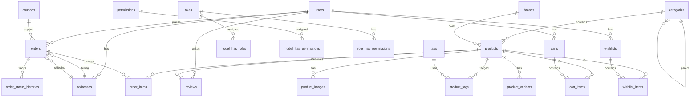

# Database Design

## ER Diagram



## Roles (Spatie Permission)

| Role | Description |
|------|-------------|
| super-admin | Full system access |
| admin | Manage products, orders, customers |
| customer | Default for registered users |

## Migrations

All migrations are in `backend/database/migrations/`:

1. `0001_01_01_000000_create_users_table.php` — Users + Sanctum tokens
2. `0001_01_01_000001_create_catalog_tables.php` — Products, categories, brands
3. `0001_01_01_000002_create_commerce_tables.php` — Orders, cart, reviews, settings

Run Spatie Permission migration after install:
```bash
php artisan vendor:publish --provider="Spatie\Permission\PermissionServiceProvider"
php artisan migrate
```
